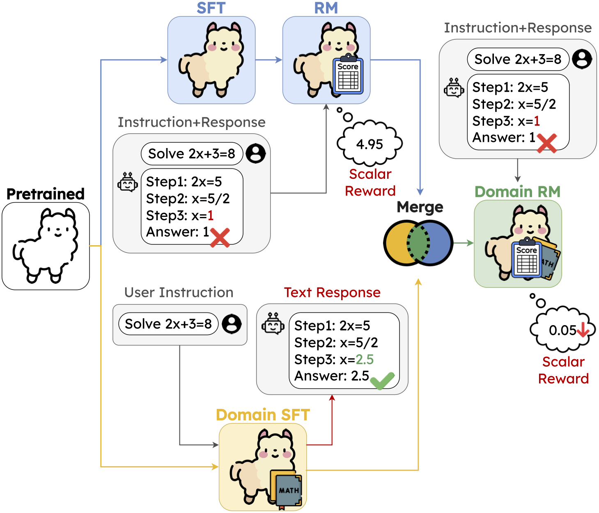

<div align="center">

# DogeRM: Equipping Reward Models with Domain Knowledge through Model Merging

[](https://arxiv.org/abs/2407.01470)
[](https://huggingface.co/collections/miulab/dogerm-66feaa037d722f0879be4332)

<p align="center">
<!--  -->


<em>Overview of our DogeRM framework. We merge the general RM with a domain-specific LM to create the domain-specific RM. All icons used in this figure are sourced from https://www.flaticon.com/</em>
</p>

</div>

# News
- [2024.10.06] We release our experimental codes and the model collections on [🤗huggingface](https://huggingface.co/collections/miulab/dogerm-66feaa037d722f0879be4332).
- [2024.09.20]: 🎉🎉🎉 Our paper is accepted at **EMNLP 2024 main conference (short paper)**. 🎉🎉🎉

# Code for Reproducing Our Results

Please clone our repo first:

```bash
git clone https://github.com/MiuLab/DogeRM.git
```

Additionally, **install** the following repo for evaluation:

1. [RewardBench](https://github.com/allenai/reward-bench)
2. [BigCode-Evaluation-Harness](https://github.com/bigcode-project/bigcode-evaluation-harness)

And **clone** [Auto-J Eval Repo](https://github.com/GAIR-NLP/auto-j) for accessing Auto-J Eval pairwise testing data, which can be found at `data/testing/testdata_pairwise.jsonl`.

## Environment

After install conda:
```bash
cd DogeRM/
conda create -n {your_env_name} -f environment.yaml
conda activate {your_env_name}
```

## Evaluation

### Reward Bench

We include our modified RewardBench here, where the modification includes:
1. use system prompt for our LLaMA-2 based RM, which is not included in the original implementation
2. Load RM with `float16` precision.
3. print the result of each subset to `stdout`
4. report the result to `wandb`

Since the python version required by reward-bench is different from what we used in RM training, so we create a separate environment for reward-bench.

You should create a new environment first:
```bash
cd reward-bench/
conda create -n {your_env_name_for_reward_bench} -f environment.yml
conda activate {your_env_name_for_reward_bench}
```

Then, run the following code, which contains the whole pipeline for merging and evaluation:
```bash
reward_model="miulab/llama2-7b-ultrafeedback-rm"
langauge_model="miulab/llama2-7b-magicoder-evol" # or other langauge models
merged_model_output_path="../models/merged_model"
proj_name="{your_wandb_project_name}"
run_name_prefix="{wandb_run_name_prefix}" 
# the run name on wandb will be $run_name_prefix-seq-$seq_ratio-lm-$lm_ratio
# where $seq_ratio is the weight for RM parameter
# and $lm_ratio is the weight for language model parameter
# in the merging process

bash run_merge.sh \
    $reward_model \
    $language_model \
    $merged_model_output_path \
    $project_name 
```

The evaluation result can be found at `wandb`.

### Auto-J Eval

For Auto-J Eval, you can run the whole pipeline, including merging and evaluation, using:

```bash
reward_model="miulab/llama2-7b-ultrafeedback-rm"
langauge_model="miulab/llama2-7b-magicoder-evol-instruct"
merged_model_output_path="../models/merged_model"
autoj_data_path="{path_to_autoj_pairwise_testing_data}"

cd scripts/
bash run_autoj_merge.sh \
    $reward_model \
    $langauge_model \
    $merged_model_output_path \
    $autoj_data_path
```

The evaluation result will be printed to `stdout`.

### Best-of-N (GSM8K)

For GSM8K, you can run the whole pipeline, including merging and evaluation, using:
```bash
reward_model="miulab/llama2-7b-ultrafeedback-rm"
langauge_model="miulab/llama2-7b-magicoder-evol-instruct"
merged_model_output_path="../models/merged_model"
bon_output_root="../bon_output/llama2/mbpp"
lm_output_file_name="llama2-chat.json"
log_file_name="log_file.txt"
rm_output_file_prefix="ultrafeedback-code"

cd scripts/
bash merge_gsm8k_bon.sh \
    $reward_model \
    $langauge_model \
    $merged_model_output_path \
    $bon_output_root \
    $lm_output_file_name \
    $log_file_name \
    $rm_output_file_prefix
```

The evaluation results can be found at the `DogeRM/bon_output/llama2/gsm8k/log_file/{log_file_name}`.

### Best-of-N (MBPP)

For MBPP, you can run the whole pipeline, including merging and evaluation, using:
```bash
reward_model="miulab/llama2-7b-ultrafeedback-rm"
langauge_model="miulab/llama2-7b-magicoder-evol-instruct"
merged_model_output_path="../models/merged_model"
bon_output_root="../bon_output/llama2/mbpp"
lm_output_file_name="llama2-chat.json"
log_file_name="log_file.txt"
rm_output_file_prefix="ultrafeedback-code"
path_to_bigcode_eval="{path_to_bigcocde_evaluation_harness_repo}"

cd scripts/
bash merge_mbpp_bon.sh \
    $reward_model \
    $language_model \
    $merged_model_output_path \
    $bon_output_root \
    $lm_output_file_name \
    $log_file_name \
    $rm_output_file_prefix \
    $path_to_bigcode_eval
```

The evaluation results can be found at `DogeRM/bon_output/execution_result/`.

## Train base RM

```bash
deepspeed --num_gpus {num_gpus_on_your_device} src/train_rm.py \
    --model_name_or_path miulab/llama2-7b-alpaca-sft-10k \
    --output_dir models/llama2-7b-ultrafeedback \
    --report_to wandb \
    --run_name {wabdb_run_name} \
    --per_device_train_batch_size 4 \
    --num_train_epochs 1 \
    --fp16 True \
    --gradient_accumulation_steps 1 \
    --torch_dtype auto \
    --learning_rate 1e-5 \
    --warmup_ratio 0.05 \
    --remove_unused_columns False \
    --optim adamw_torch \
    --logging_first_step True \
    --logging_steps 10 \
    --evaluation_strategy steps \
    --eval_steps 0.1 \
    --save_strategy steps \
    --save_steps 100000000 \
    --save_total_limit 1 \
    --max_length 2048 \
    --test_size 0.1 \
    --dataset_shuffle_seed 42 \
    --dataset_name argilla/ultrafeedback-binarized-preferences-cleaned \
    --dataset_config_path config/dataset.yaml \
    --gradient_checkpointing True \
    --deepspeed config/ds_config.json
```

## Merge RM with SFT-ed Language Model

```bash
python src/merge_linear.py \
    --seq_model {your_reward_mdoel} \
    --seq_weight {weight_for_reward_model_parameters} \
    --lm_model {your_langauge_model} \
    --lm_weight {weight_for_language_model_parameters} \
    --output_path {output_path_for_merged_model}
```

# Citation
If you find our code and models useful, please cite our paper using the following bibtex:
```bibtex
@article{lin2024dogerm,
    title={DogeRM: Equipping Reward Models with Domain Knowledge through Model Merging},
    author={Lin, Tzu-Han and Li, Chen-An and Lee, Hung-yi and Chen, Yun-Nung},
    journal={arXiv preprint arXiv:2407.01470},
    year={2024}
}
```

# Acknowledgement
We thank the reviewers for their insightful comments. This work was financially supported by the National Science and Technology Council (NSTC) in Taiwan, under Grants 111-2222-E-002-013-MY3 and 112-2223-E002-012-MY5. We thank to National Center for High-performance Computing (NCHC) of National Applied Research Laboratories (NARLabs) in Taiwan for providing computational and storage resources. We are also grateful to Yen-Ting Lin, Wei-Lin Chen, Chao-Wei Huang and Wan-Xuan Zhou from National Taiwan University for their insightful discussions and valuable advice on the overview figure.